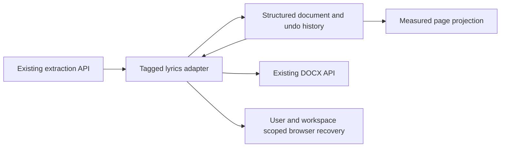

# ADR 0003: Structured song document editor

Status: Accepted (implementation decisions based on the 14 user choices).

## Decision

Use a lazy-loaded ProseMirror editor with a deliberately small schema: an
ordered document of tagged sections, each containing plain lyric lines. Tags
are protected headings, changed with commands. Selection tagging expands to
whole lines. Section boundaries are isolating; merging is an explicit action.
The editor owns one undo history for typing and structural commands.

Letter pages (816 x 1056 CSS pixels, 96px margins) are a visual projection.
Measured line heights and non-content decorations keep slide groups together
and make page gaps editable across one continuous selection surface. Page
layout does not enter the song data or undo history. DOCX pagination is
approximate; Word remains responsible for its final layout. Arial 11 is fixed.
Phones use continuous editing and a separate read-only page preview.

### Two-page projection refinement

At zoom <=75%, use two columns only when both scaled Letter pages fit the
available viewport (after the outline and padding). Otherwise use one column.
Place measured lyric nodes and headings with non-content node decorations in
one EditorView, in original DOM/document order. This retains a single native
selection, clipboard and undo surface; separate per-page editors would break
those contracts. Recompute positions after text, viewport or column changes,
never during IME composition. Page count and export content do not depend on
zoom. The controls occupy one separate card; the unframed viewer scrolls.
The tradeoff is explicit layout measurement and browser regression coverage
for hit-testing, cross-page selection and caret navigation. No new dependency,
storage contract or cloud service is required.

ProseMirror's scroll-to-selection is handled after the measured decoration
transaction and the React page dimensions settle. Splitting a paragraph can
drop its previous positioning decoration; scrolling before measurement would
incorrectly target the document origin. Only the document viewport scrolls,
not the application shell, and scroll anchoring is disabled on that viewport.

## Boundaries and alternatives

Separate textareas cannot support continuous cross-page selection. A custom
contenteditable implementation would have to own IME, selection mapping,
clipboard, and undo. ProseMirror provides those mechanisms without a cloud
service or paid pagination dependency. Its schema and commands remain usable
outside the browser; DOM measurement is confined to the page adapter.

The first release exports DOCX only and retains FreeShow tags and blank-line
slide separators. No song-library persistence, API wire change, schema
migration, rich text styling, manual page breaks, or collaboration is added.
Directly editable tag text is a recorded future option, not the current model.

## Recovery and failure handling

One versioned local draft per authenticated user and workspace is restored only
after identity and membership have been resolved. Store lyrics, title, warning
codes and the used-AI flag, never access tokens, retry tokens, uploaded files,
or arbitrary HTML. Validate stored data and bound its size. Storage failure
leaves editing/export available and displays an honest unsaved status. Clear
draft deletes recovery data. Recovery is device-local, not a library save.

## Acceptance

- Typing, IME, native clipboard, selection across pages, and undo/redo work.
- Tag, split, explicit merge, insert, duplicate, reorder, and delete preserve
  lyric order and are undoable; Backspace cannot merge adjacent sections.
- Page breaks never modify text, tags, caret positions, or undo history.
- Existing DOCX output keeps its tag, title, escaping and separator contracts.
- Warnings, AI reformat, export pending/errors and tag management remain usable.
- Refresh recovery is isolated by user/workspace; malformed or blocked storage
  does not break editing. Mobile and keyboard commands cover the same actions.
