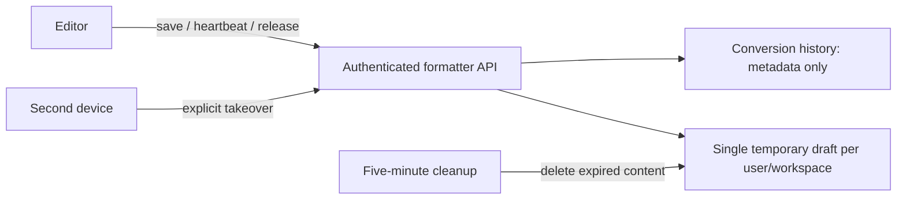

# ADR 0004: Temporary cross-device song drafts

Status: Accepted for implementation.

The formatter is an editing workflow, not a file archive. Keep metadata in a
formatter conversion record and editable lyrics in a separate disposable draft.
One draft exists per Prisma user/workspace; server transactions serialize changes
for that scope. Authentication and active membership are checked inside handlers.
Both formatter tables enable RLS without browser policies, and direct Data API
roles have no table privileges. Only the privileged server Prisma connection
accesses them, following [Supabase's API security guidance](https://supabase.com/docs/guides/api/securing-your-api).

The current editor holds a session lease with revision-checked saves. A second
device must explicitly take over; this is not collaborative editing. Release
starts a one-hour TTL. Heartbeats every 30 seconds maintain the session; five
minutes without contact starts the fallback hour. Resume cancels expiry. Export
does not finish. Only successfully persisted extraction replaces the old draft.

Expired, cleared, and replaced content is deleted; Done history cannot be edited
or downloaded. A five-minute cleanup runner plus opportunistic cleanup removes
expired records without depending on browser activity. Production must provision
the authenticated scheduler invocation before rollout. Browser copies are only
fallbacks, validated against the authoritative identity/revision before reuse.

Alternatives rejected: browser-only storage (no cross-device recovery), storing
lyrics in AutomationJob JSON (mixes execution and editor lifecycle and retains
content), and real-time collaborative editing (unnecessary complexity).

Core lifecycle logic has no browser/cloud dependency; Prisma handles persistence,
leaving a future SQLite/Tauri adapter possible. Service block order is unaffected.

