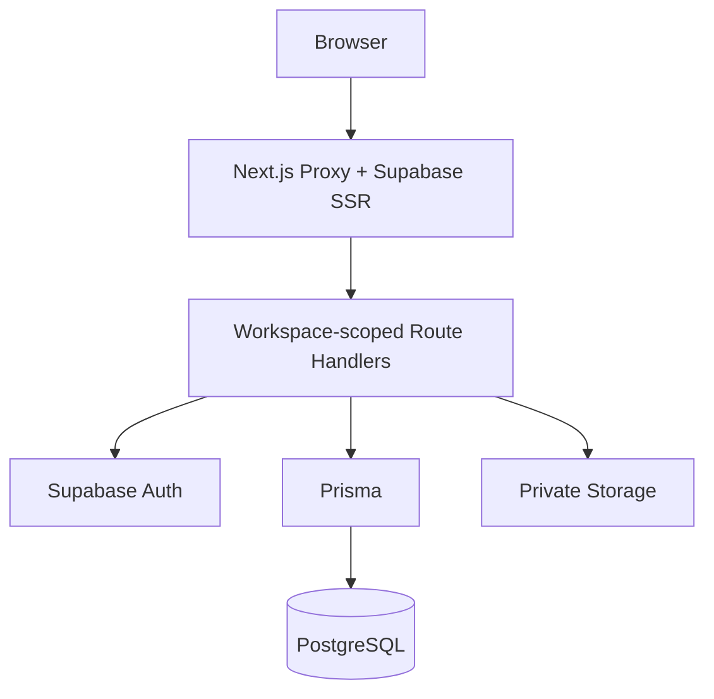
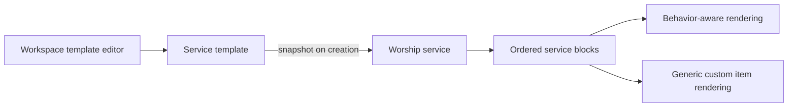

# Worship Flow Architecture

Worship Flow is a modular Next.js monolith for preparing worship services. A
`Workspace` is one church organization, and all service-preparation data is
owned by that workspace.



## Tenant boundary

Workspace pages use `/w/{workspaceSlug}/...`. Workspace APIs use
`/api/workspaces/{workspaceSlug}/...`; the Proxy rewrites these to the existing
feature handlers while carrying the workspace slug in request context. Route
handlers enforce membership and role authorization.

## Identity and access

Supabase Auth owns authentication, sessions, and invitation email delivery.
Application tables own `User`, `WorkspaceMembership`, and
`WorkspaceInvitation`.

- `OWNER` controls the organization and all workspace actions.
- `ADMIN` manages preparation, settings, and membership.
- `MEMBER` has read-only access.

Settings is canonical at `/w/{workspaceSlug}/settings`. Workspace name,
membership, invitations, service-preparation presets, templates, program block
types, song tags, checklists, and workspace AI integration overrides live there.
Teams remains the service-team assignment surface.

Proxy refreshes sessions and performs optimistic redirects. Route handlers are
the authorization boundary and must verify active workspace membership.

## Invitation flow

Owner/Admin creates a pending invitation. Supabase sends the email. The auth
callback verifies the authenticated email against the pending invitation before
creating an active membership transactionally.

## Decisions

The service workflow, settings, media tools, and APIs remain in one Next.js
application. Durable AI workers and billing are deferred until usage requires
them. Prisma remains the application data boundary; the browser does not access
application tables through the Supabase Data API.

Templates continue to copy active blocks into stored `WorshipServiceBlock`
rows at creation time, and rendering follows stored block order.

`ServiceTemplateBlock` is the active source of truth for template order, field
definitions, and defaults. Creating a service snapshots those ordered blocks
and their definitions into `WorshipServiceBlock` rows. Legacy
`ServiceTemplatePreset.blocks` data is backfilled once and is no longer written
by Settings. Program block versions are a compatibility fallback only; new or
imported templates do not depend on a workspace-wide block-type library.

New workspaces can receive platform-managed starter templates as private,
editable workspace copies. Each church defines its own names, fields, and
order; no starter or template change crosses a workspace boundary. Legacy enum
behavior is retained only as a compatibility mapping, while unknown workspace
keys use `CUSTOM`.

Workspace integration API keys are encrypted server-side and never returned to
the browser. Workspace overrides take precedence over deployment environment
defaults; Supabase, database, storage, and authentication credentials remain
deployment-owned.

### Generalized program blocks

Service templates use a hybrid block model. Built-in `BlockType` values preserve
behavior-aware workflows such as songs, scripture, sermons, and participants;
`CUSTOM` provides a generic worship-service program item with label and details.
Templates are workspace-scoped starting points. New services receive a snapshot
of the template, after which the service owns its block order and block set.



Template changes never rewrite existing services. Service operators may reorder,
rename, add, or remove blocks from an individual service. Arbitrary custom field
builders, nested blocks, and canvas layouts are intentionally deferred until
real service workflows demonstrate the need.

## Provisioning

```powershell
npm run provision:workspace -- --name "Example Church" --slug example --owner-email owner@example.com
```

The script is idempotent by workspace slug and sends the first Owner an email
invitation.
