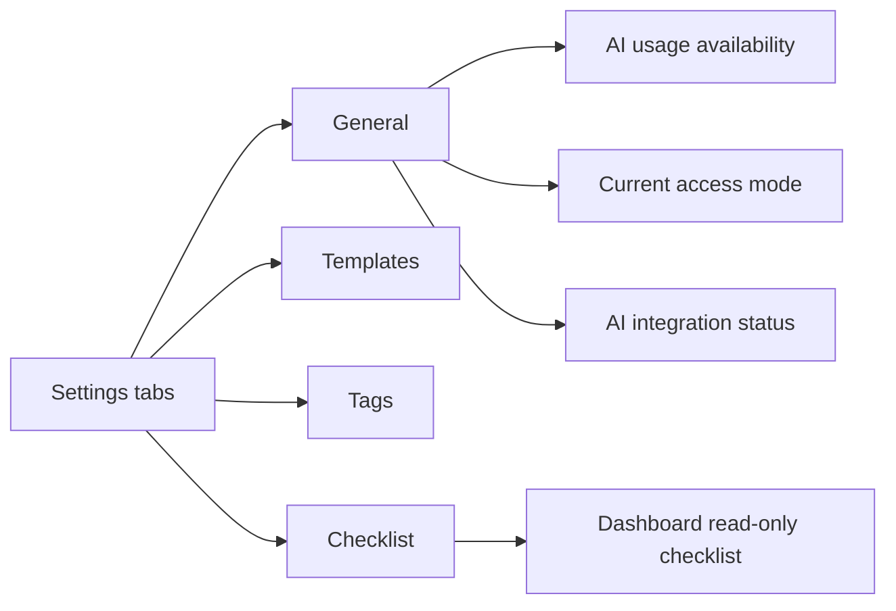

# Worship Flow 1.1 Release Spec

**Status:** Implemented; pending review
**Theme:** One clear control surface for worship-service preparation settings

## Outcome

Version 1.1 makes Settings easier to scan and makes its checklist configuration
the single source of truth for the Dashboard. It also introduces a small
General tab for operational visibility without pulling the product into church
management or a new account system.

## Feature Plot

## Release Slices

| Order | Slice | User result | Dependency |
| --- | --- | --- | --- |
| 1 | [Settings Page](./settings-page/spec.md) | Existing settings are grouped into four accessible tabs. | Existing settings APIs |
| 2 | [Checklist Management](./checklist-management/spec.md) | Dashboard shows the active checklist configured in Settings. | Settings checklist API |
| 3 | [General Settings](./general-settings/spec.md) | Operators can see relevant workspace and AI operational status. | Available server-side status only |

## Release Boundaries

- No new `WorshipService` behavior or service-order changes.
- No user accounts, invitations, roles, or organization model.
- No OpenAI OAuth or bring-your-own-account flow.
- No billing ledger or promise of provider credit balances.
- No editable checklist on the Dashboard.
- No new design tokens, animation library, or settings framework.

## Release Acceptance

- Every existing Settings control remains reachable.
- The four tabs work with keyboard and pointer input at supported breakpoints.
- Dashboard checklist content comes from the Settings checklist endpoint.
- General status never fabricates usage, credit, access, or connection data.
- Existing worship-service creation and template behavior is unchanged.

## Proposed Delivery Check

1. Run the existing automated checks.
2. Verify each tab at desktop and mobile widths.
3. Change an active checklist item in Settings and confirm the Dashboard reflects it.
4. Verify loading, empty, unavailable, and success states.
5. Confirm no service template or stored block order changes.

## Review Decisions

- [ ] Approve the four-tab information architecture.
- [ ] Approve General as status-only for access and integrations in 1.1.
- [ ] Approve deferring individual accounts and managed access to 1.2.
- [ ] Approve showing AI usage only when a reliable value exists.
